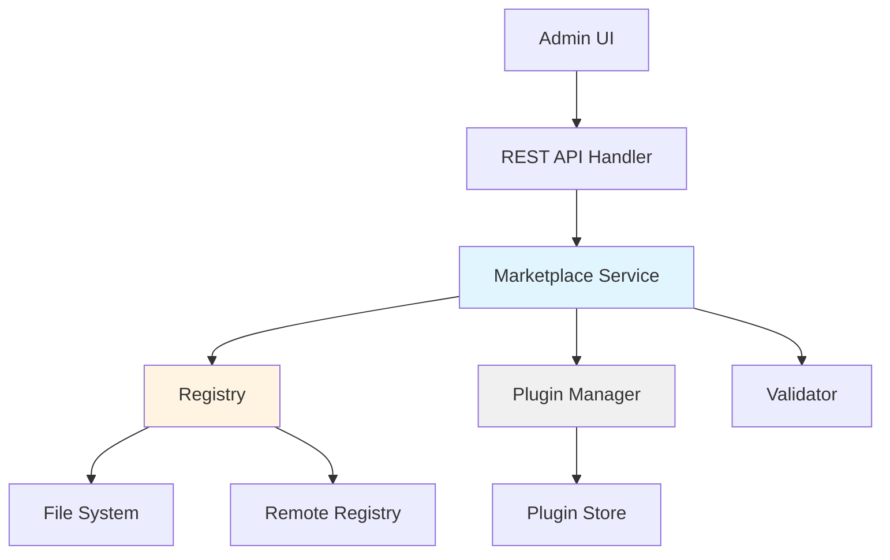

# Design Document: Plugin Marketplace

## Overview

The Plugin Marketplace extends CC Gateway's existing plugin system with a catalog-based discovery and installation experience. The design introduces a Registry component for storing plugin manifests, a Marketplace service for search and installation orchestration, and REST API endpoints for programmatic access. The system supports both local file-based registries and remote registry sources, enabling curated plugin bundles and community contributions.

The architecture builds on the existing `internal/plugin/manager.go` implementation, adding marketplace-specific functionality without modifying the core plugin lifecycle management.

## Architecture

### Component Diagram



### Data Flow

1. **Plugin Discovery**: User → Admin UI → GET /v1/cc/marketplace/plugins → Marketplace Service → Registry → Plugin Manifests
2. **Plugin Installation**: User → Admin UI → POST /v1/cc/marketplace/plugins/{name}/install → Marketplace Service → Validator → Plugin Manager → Plugin Store
3. **Search**: User → Admin UI → GET /v1/cc/marketplace/search?q=proxy&tags=integration → Marketplace Service → Registry → Filtered Results

## Components and Interfaces

### Registry Component

The Registry manages plugin manifests and provides query capabilities.

**Location**: `internal/marketplace/registry.go`

**Interface**:
```go
type Registry interface {
    // List returns all available plugin manifests
    List() ([]PluginManifest, error)
    
    // Get retrieves a specific plugin manifest by name
    Get(name string) (PluginManifest, error)
    
    // Search finds plugins matching query and tag filters
    Search(query string, tags []string) ([]PluginManifest, error)
    
    // Add registers a new plugin manifest
    Add(manifest PluginManifest) error
    
    // Remove deletes a plugin manifest
    Remove(name string) error
    
    // Refresh reloads manifests from the source
    Refresh() error
}
```

**Implementation Strategy**:
- `LocalRegistry`: Reads manifests from `configs/marketplace/` directory
- `RemoteRegistry`: Fetches manifests from HTTP endpoint (future extension)
- `CompositeRegistry`: Combines multiple registry sources with priority ordering

### Marketplace Service

The Marketplace Service orchestrates plugin discovery, validation, and installation.

**Location**: `internal/marketplace/service.go`

**Interface**:
```go
type Service struct {
    registry      Registry
    pluginManager *plugin.Manager
    validator     *Validator
}

func NewService(registry Registry, pluginManager *plugin.Manager) *Service

// ListAvailable returns all plugins in the marketplace
func (s *Service) ListAvailable() ([]PluginManifest, error)

// GetManifest retrieves a specific plugin manifest
func (s *Service) GetManifest(name string) (PluginManifest, error)

// Search finds plugins matching criteria
func (s *Service) Search(query string, tags []string) ([]PluginManifest, error)

// Install installs a plugin from the marketplace
func (s *Service) Install(name string, config map[string]string) error

// CheckUpdates compares installed versions with registry versions
func (s *Service) CheckUpdates() ([]UpdateInfo, error)

// Update updates an installed plugin to the latest version
func (s *Service) Update(name string) error

// GetRecommendations returns recommended plugins
func (s *Service) GetRecommendations() ([]PluginManifest, error)
```

### Validator Component

The Validator ensures plugin manifests are safe and well-formed.

**Location**: `internal/marketplace/validator.go`

**Interface**:
```go
type Validator struct{}

func NewValidator() *Validator

// ValidateManifest checks manifest structure and content
func (v *Validator) ValidateManifest(manifest PluginManifest) error

// ValidateName checks plugin name format
func (v *Validator) ValidateName(name string) error

// ValidateVersion checks semantic versioning
func (v *Validator) ValidateVersion(version string) error

// ValidateCommand checks for shell injection risks
func (v *Validator) ValidateCommand(command string) error
```

### REST API Handler

The API handler exposes marketplace functionality via HTTP endpoints.

**Location**: `internal/gateway/cc_marketplace_handler.go`

**Endpoints**:
- `GET /v1/cc/marketplace/plugins` - List all available plugins
- `GET /v1/cc/marketplace/plugins/{name}` - Get specific plugin manifest
- `POST /v1/cc/marketplace/plugins/{name}/install` - Install plugin
- `GET /v1/cc/marketplace/search` - Search plugins
- `GET /v1/cc/marketplace/updates` - Check for updates
- `GET /v1/cc/marketplace/recommendations` - Get recommended plugins

## Data Models

### PluginManifest

```go
type PluginManifest struct {
    Name         string            `json:"name"`
    Version      string            `json:"version"`
    Description  string            `json:"description"`
    Author       string            `json:"author"`
    Tags         []string          `json:"tags,omitempty"`
    Dependencies []Dependency      `json:"dependencies,omitempty"`
    Homepage     string            `json:"homepage,omitempty"`
    License      string            `json:"license,omitempty"`
    IconURL      string            `json:"icon_url,omitempty"`
    Skills       []SkillConfig     `json:"skills,omitempty"`
    Hooks        []HookConfig      `json:"hooks,omitempty"`
    MCPServers   []MCPServerConfig `json:"mcp_servers,omitempty"`
    ConfigSchema map[string]ConfigField `json:"config_schema,omitempty"`
}

type Dependency struct {
    Name           string `json:"name"`
    VersionConstraint string `json:"version_constraint"` // e.g., ">=1.0.0", "^2.0.0"
}

type ConfigField struct {
    Type        string `json:"type"`        // "string", "int", "bool", "url"
    Description string `json:"description"`
    Required    bool   `json:"required"`
    Default     string `json:"default,omitempty"`
}

type SkillConfig struct {
    Name        string `json:"name"`
    Description string `json:"description,omitempty"`
    Template    string `json:"template"`
}

type HookConfig struct {
    Name     string `json:"name"`
    Point    string `json:"point"`
    Priority int    `json:"priority"`
}

type MCPServerConfig struct {
    Name      string `json:"name"`
    Transport string `json:"transport"`
    URL       string `json:"url,omitempty"`
    Command   string `json:"command,omitempty"`
}
```

### UpdateInfo

```go
type UpdateInfo struct {
    PluginName       string `json:"plugin_name"`
    CurrentVersion   string `json:"current_version"`
    AvailableVersion string `json:"available_version"`
    UpdateAvailable  bool   `json:"update_available"`
}
```

### SearchResult

```go
type SearchResult struct {
    Manifest      PluginManifest `json:"manifest"`
    RelevanceScore float64       `json:"relevance_score"`
    Installed     bool           `json:"installed"`
    InstalledVersion string      `json:"installed_version,omitempty"`
}
```

## Correctness Properties

*A property is a characteristic or behavior that should hold true across all valid executions of a system—essentially, a formal statement about what the system should do. Properties serve as the bridge between human-readable specifications and machine-verifiable correctness guarantees.*


### Registry Properties

Property 1: Manifest round-trip preservation
*For any* valid plugin manifest with all fields (name, version, description, author, tags, dependencies, skills, hooks, mcp_servers), storing it in the registry and then retrieving it should return an equivalent manifest with all fields preserved.
**Validates: Requirements 1.1, 2.4**

Property 2: Manifest validation rejects invalid structure
*For any* plugin manifest with invalid structure (missing required fields, malformed JSON, invalid types), attempting to add it to the registry should result in rejection with an error.
**Validates: Requirements 1.2**

Property 3: Query completeness
*For any* set of plugin manifests added to the registry, querying the registry should return all added manifests.
**Validates: Requirements 1.4**

Property 4: Version history preservation
*For any* plugin name, adding multiple versions of that plugin to the registry should result in all versions being maintained and retrievable.
**Validates: Requirements 1.5**

### Manifest Validation Properties

Property 5: Required field validation
*For any* manifest missing one or more required fields (name, version, description, author), validation should reject it with an error indicating which fields are missing.
**Validates: Requirements 2.1, 7.1**

Property 6: Optional field acceptance
*For any* valid manifest with optional fields (tags, dependencies, homepage, license, icon_url) present or absent, validation should accept it as long as required fields are present.
**Validates: Requirements 2.2**

Property 7: Dependency structure validation
*For any* manifest with dependencies, each dependency should have a name and version_constraint field, and validation should reject manifests with malformed dependency structures.
**Validates: Requirements 2.3**

Property 8: Plugin name format validation
*For any* plugin name containing characters other than alphanumeric, hyphens, or underscores, validation should reject it.
**Validates: Requirements 7.2**

Property 9: Semantic version validation
*For any* version string not following semantic versioning format (major.minor.patch), validation should reject it.
**Validates: Requirements 7.3**

Property 10: Command injection prevention
*For any* MCP server command containing suspicious patterns (shell metacharacters, command chaining, path traversal), validation should reject it.
**Validates: Requirements 7.4**

### Search Properties

Property 11: Text search matches name or description
*For any* search query string and set of plugins, all returned results should have the query string as a substring in either the name or description (case-insensitive).
**Validates: Requirements 3.1**

Property 12: Tag filter returns only matching plugins
*For any* tag filter and set of plugins, all returned results should contain that tag in their tags array.
**Validates: Requirements 3.2**

Property 13: Multiple tag filters use AND logic
*For any* set of tag filters and set of plugins, all returned results should contain all specified tags.
**Validates: Requirements 3.3**

Property 14: Search results contain required fields
*For any* search result, it should include name, version, description, author, tags, and installed status fields.
**Validates: Requirements 3.4**

Property 15: Results sorted by relevance score
*For any* search results with relevance scores, the results should be sorted in descending order by relevance_score.
**Validates: Requirements 3.5**

### Installation Properties

Property 16: Successful installation enables plugin
*For any* plugin manifest in the registry, successfully installing it should result in the plugin appearing in the plugin manager with enabled=true.
**Validates: Requirements 4.1, 4.4**

Property 17: Dependency validation before installation
*For any* plugin with dependencies, attempting to install it when dependencies are not installed should fail with an error indicating missing dependencies.
**Validates: Requirements 4.2, 4.3**

Property 18: Installation atomicity on failure
*For any* installation that fails (due to validation, missing dependencies, or other errors), no partial plugin state should remain in the plugin manager.
**Validates: Requirements 4.5**

Property 19: Bundle default configuration
*For any* pre-built bundle installed without providing configuration, the installed plugin should have valid default values for all required configuration fields.
**Validates: Requirements 5.2**

Property 20: Bundle completeness
*For any* installed bundle that declares skills, hooks, or mcp_servers in its manifest, the installed plugin should have non-empty arrays for those components.
**Validates: Requirements 5.3**

Property 21: Required configuration validation
*For any* bundle with required configuration fields (as defined in config_schema), attempting to install without providing those fields should fail with an error listing the missing fields.
**Validates: Requirements 5.4**

Property 22: Bundle documentation presence
*For any* bundle manifest, it should have a non-empty description field.
**Validates: Requirements 5.5**

### Update Properties

Property 23: Update detection
*For any* installed plugin with version V1, if the registry contains the same plugin with version V2 where V2 > V1, checking for updates should return an UpdateInfo indicating an update is available.
**Validates: Requirements 6.1, 6.2**

Property 24: Update replaces version
*For any* installed plugin with version V1, updating it when version V2 is available should result in the plugin manager showing version V2 as installed.
**Validates: Requirements 6.3**

Property 25: Update rollback on failure
*For any* plugin update that fails, the plugin manager should still show the original version as installed.
**Validates: Requirements 6.4**

Property 26: Configuration preservation during update
*For any* installed plugin with custom configuration, updating it should preserve the custom configuration values.
**Validates: Requirements 6.5**

### Error Handling Properties

Property 27: Descriptive error messages
*For any* operation that fails (validation, installation, update), the error message should be non-empty and contain specific information about the failure cause.
**Validates: Requirements 2.5, 4.5, 7.5**

### Recommendation Properties

Property 28: Recommendation count limit
*For any* call to GetRecommendations, the returned list should contain at most 5 plugins.
**Validates: Requirements 10.5**

## Error Handling

### Validation Errors

**Manifest Validation Failures**:
- Missing required fields → HTTP 400, error type: "invalid_manifest", message: "missing required field: {field_name}"
- Invalid name format → HTTP 400, error type: "invalid_manifest", message: "plugin name must contain only alphanumeric characters, hyphens, and underscores"
- Invalid version format → HTTP 400, error type: "invalid_manifest", message: "version must follow semantic versioning (major.minor.patch)"
- Suspicious command → HTTP 400, error type: "security_error", message: "command contains potentially unsafe patterns"

### Installation Errors

**Dependency Errors**:
- Missing dependencies → HTTP 400, error type: "dependency_error", message: "missing required dependencies: {dep1, dep2}"
- Circular dependencies → HTTP 400, error type: "dependency_error", message: "circular dependency detected: {chain}"

**Conflict Errors**:
- Plugin already installed → HTTP 409, error type: "conflict", message: "plugin {name} is already installed"
- Name collision → HTTP 409, error type: "conflict", message: "plugin name conflicts with existing plugin"

**Registry Errors**:
- Plugin not found in registry → HTTP 404, error type: "not_found", message: "plugin {name} not found in marketplace"
- Registry unavailable → HTTP 503, error type: "service_unavailable", message: "marketplace registry is temporarily unavailable"

### Update Errors

**Version Errors**:
- No update available → HTTP 400, error type: "invalid_request", message: "plugin {name} is already at the latest version"
- Downgrade attempt → HTTP 400, error type: "invalid_request", message: "cannot downgrade from version {v1} to {v2}"

**Rollback Errors**:
- Update failure → HTTP 500, error type: "update_failed", message: "update failed: {reason}. Previous version restored."

## Testing Strategy

### Dual Testing Approach

The testing strategy employs both unit tests and property-based tests to ensure comprehensive coverage:

**Unit Tests**: Focus on specific examples, edge cases, and integration points:
- Specific pre-built bundle installations (GLM Local, OpenAI Proxy, etc.)
- API endpoint responses and status codes
- Error message formatting
- Edge cases like empty registries, single-plugin registries
- Integration between marketplace service and plugin manager

**Property-Based Tests**: Verify universal properties across all inputs:
- Manifest validation rules across randomly generated manifests
- Search behavior across random plugin sets and queries
- Installation and update flows with random plugin configurations
- Dependency resolution with random dependency graphs
- Version comparison logic with random version strings

### Property-Based Testing Configuration

**Framework**: Use `gopter` (Go property testing library) for property-based tests

**Test Configuration**:
- Minimum 100 iterations per property test
- Each test tagged with: `// Feature: plugin-marketplace, Property {N}: {property_text}`
- Custom generators for: PluginManifest, version strings, plugin names, search queries

**Example Test Structure**:
```go
// Feature: plugin-marketplace, Property 1: Manifest round-trip preservation
func TestProperty_ManifestRoundTrip(t *testing.T) {
    properties := gopter.NewProperties(gopter.MinSuccessfulTests(100))
    
    properties.Property("storing and retrieving manifest preserves all fields", 
        prop.ForAll(
            func(manifest PluginManifest) bool {
                registry := NewLocalRegistry()
                _ = registry.Add(manifest)
                retrieved, _ := registry.Get(manifest.Name)
                return manifestsEqual(manifest, retrieved)
            },
            genValidManifest(),
        ))
    
    properties.TestingRun(t)
}
```

### Test Coverage Goals

- Unit test coverage: >80% of lines in marketplace package
- Property test coverage: All 28 correctness properties implemented
- Integration test coverage: All REST API endpoints
- End-to-end test: Complete install → update → uninstall flow

### Testing Priorities

1. **Critical Path**: Manifest validation, installation flow, dependency resolution
2. **Security**: Command injection prevention, name validation
3. **Data Integrity**: Round-trip preservation, rollback on failure
4. **User Experience**: Search accuracy, error message clarity

## Implementation Notes

### Registry Storage Format

Plugin manifests stored as JSON files in `configs/marketplace/`:
```
configs/marketplace/
├── glm-local.json
├── openai-proxy.json
├── anthropic-proxy.json
├── search-tools.json
└── file-tools.json
```

Each file contains a complete PluginManifest JSON object.

### Version Comparison

Use semantic versioning comparison:
- Parse versions into (major, minor, patch) tuples
- Compare lexicographically: major first, then minor, then patch
- Version constraints support: `>=`, `>`, `=`, `<`, `<=`, `^` (compatible), `~` (approximately)

### Dependency Resolution

Simple dependency resolution (no transitive dependencies in v1):
1. Check if all direct dependencies are installed
2. If any missing, return error with list of missing dependencies
3. No automatic dependency installation (user must install manually)

Future enhancement: Transitive dependency resolution with topological sort

### Search Relevance Scoring

Simple relevance scoring algorithm:
- Exact name match: score = 100
- Name contains query: score = 50 + (query_length / name_length) * 50
- Description contains query: score = 25 + (query_length / description_length) * 25
- Tag matches query: score = 75

### Pre-Built Bundles

Initial marketplace includes these bundles:

1. **glm-local**: GLM Local model integration
2. **openai-proxy**: OpenAI API proxy configuration
3. **anthropic-proxy**: Anthropic API proxy configuration
4. **search-tools**: Web search and information retrieval tools
5. **file-tools**: File system operation tools

Each bundle includes complete Skills, Hooks, and MCP Server configurations ready for use.
